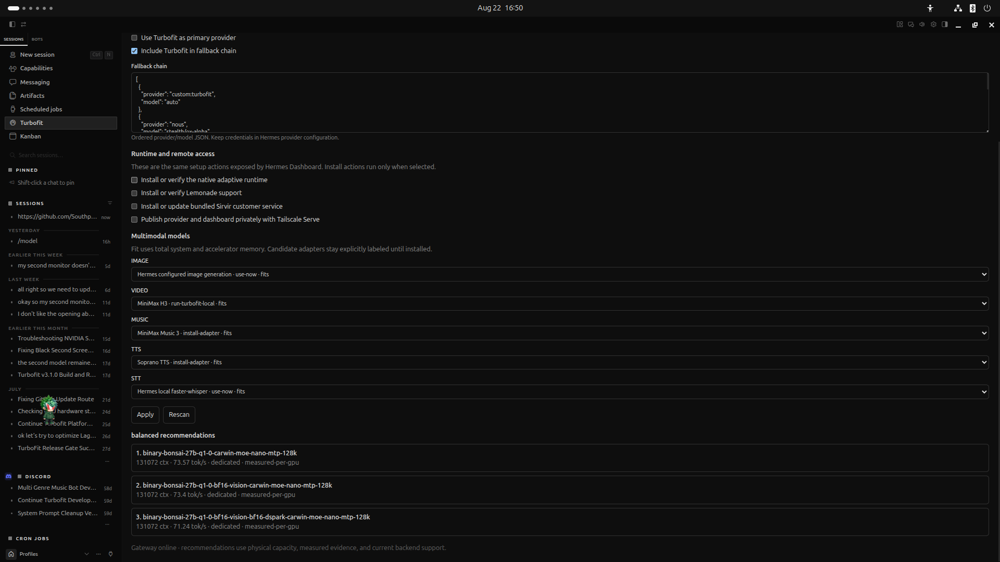
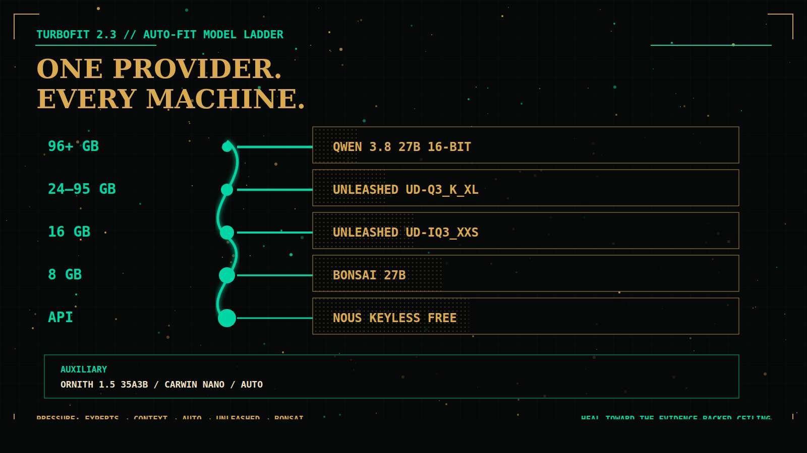
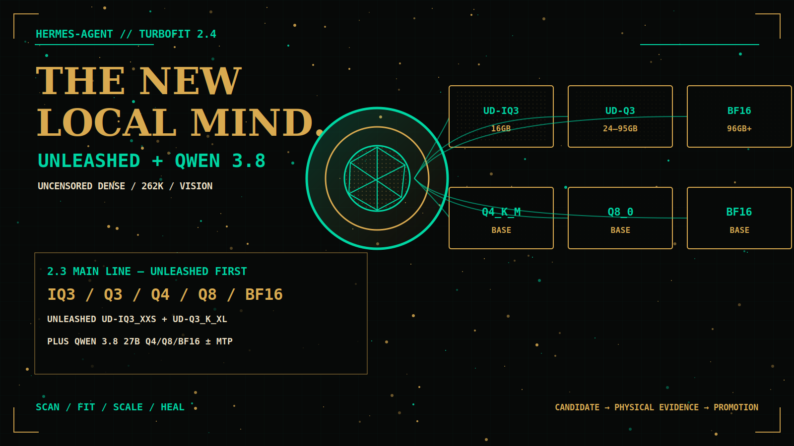
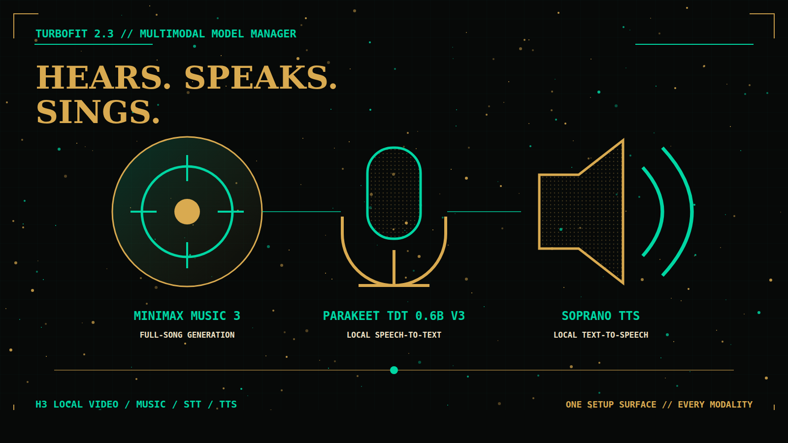

# Turbofit


**One model provider. Every machine. The best local configuration the hardware can safely sustain.**

Turbofit is a first-class [Hermes Agent](https://github.com/NousResearch/hermes-agent) provider and adaptive local-inference runtime. It inventories physical compute and total usable memory, recommends evidence-backed model configurations, launches native backends, and moves between quality, context, and speed rungs without changing the client-facing model name.



The provider is always:

```text
provider: custom:turbofit
model: auto
```

Turbofit can be the primary provider, one entry in an ordered fallback chain, or both.

**TurboFit Check** is the system scan-to-configuration process: it inventories the machine, compares it with exact hardware evidence, and applies Auto or a selected compatible lane. The **[TurboFit List](docs/turbofit-list.md)** is the separate evidence-only list of benchmark winners at each physical hardware level.

> **Evidence policy:** catalog entries are candidates until they pass the physical benchmark campaign. A candidate is never presented as a winner merely because it compiles, downloads, or fits an estimated memory budget.

## Turbofit 2.3 — Unleashed / Ornith / Nous free fallback

Turbofit 2.3 centers Auto on Qwen 3.8 27B Unleashed, Ornith 1.5, Bonsai low-memory lanes, and a keyless Nous free API safety net.

| Model | Turbofit entries | Capability | Current status |
|---|---|---|---|
| **Qwen 3.8 27B Unleashed** | `UD-IQ3_XXS`, `UD-Q3_K_XL` | Uncensored dense 27B, 262K context, vision projector | **Active catalog candidates** |
| **Ornith 1.5 35A3B** | `Q4_K_M` MoE | Auxiliary MoE with expert offload | **Active auxiliary candidate** |
| **Qwen 3.8 27B** | `Q4_K_M`, `Q8_0`, and `BF16`, each with or without MTP | Dense native image/video understanding | **Active catalog candidates** |
| **MiniMax Music 3** | `minimax-music3` | Full-song music generation | **Pinned integration candidate** |
| **NVIDIA Parakeet TDT 0.6B v3** | `parakeet-tdt-0-6b-v3` | Local speech-to-text | **Pinned integration candidate** |
| **Soprano TTS** | `soprano-tts` | Local text-to-speech | **Pinned integration candidate** |

“Active catalog candidate” means the model is selectable by the catalog/campaign machinery, not that Turbofit has fabricated a benchmark winner. Automatic promotion still requires current-recipe physical and intelligence evidence.

| Usable memory band | Main model path |
|---|---|
| 96 GB and above | Qwen 3.8 27B 16-bit until Unleashed FP16 GGUF is published |
| 24–95 GB | Qwen 3.8 27B Unleashed UD-Q3_K_XL |
| 16 GB | Qwen 3.8 27B Unleashed UD-IQ3_XXS |
| 8 GB | Bonsai 27B |
| Below 8 GB dedicated | Bonsai 27B Q1 shared-main with safe host spill; portable-fit until benchmarked on that exact box |

Auxiliary selection is **Ornith 1.5 35A3B** (default), optional **Carwin Nano**, or **auto**. Scale-down offloads Ornith experts, then lowers context, then switches aux to auto, then a listed Unleashed quant, then Bonsai. API fallback is the five keyless Nous free models.

The lineup is a product target, not fabricated benchmark evidence. Newly onboarded rows remain candidates until exact artifacts, contexts, topology, output, throughput, and cleanup pass the physical campaign. Setup exposes physically compatible local lanes on unmeasured hardware, labels them **benchmark required**, and keeps Auto on the proven API safety rung until on-box promotion completes.



### Optional FreeToken candidate runtime

[FreeToken](https://github.com/FlashML-org/FreeToken) is now integrated as a pinned, optional **candidate backend** for supported NVIDIA MoE checkpoints. Its bandwidth-adaptive CPU/GPU expert execution, semantic cache reuse, live expert/KV pool resizing, OpenAI/Anthropic APIs, and tool-call support are a strong architectural fit for future TurboFit MoE lanes.

It is deliberately **not an Auto rung**. FreeToken 0.1.2 requires Linux x86_64, NVIDIA driver 580+, CUDA toolkit 13+, HF safetensors/FTW weights, and text-only serving. At the pinned revision it does not list TurboFit's active Qwen 3.8 Unleashed or Ornith checkpoints, so no current model is replaced and no benchmark is inherited. Install/verify it from setup or with `scripts/install-freetoken-runtime --json`; promotion still requires the exact model, machine, context, tool-call, performance, intelligence, pressure, and rollback campaigns.

Full boundary and evidence plan: [`docs/freetoken-runtime.md`](docs/freetoken-runtime.md).

---

## What it does

- Detects Linux, macOS, Windows, WSL2, CPU-only, discrete-accelerator, and unified-memory systems.
- Reasons over **system RAM plus accelerator memory**, while preserving per-device limits and an OS safety reserve.
- Selects a safe hardware profile automatically or accepts a manual override.
- Exposes one OpenAI-compatible `/v1` endpoint through the Turbofit gateway.
- Runs native `llama.cpp` backends with CUDA, ROCm, Metal, Vulkan, or CPU execution as available.
- Uses Lemonade when a validated NPU recipe is available; otherwise it fails closed to a supported native backend.
- Uses DSpark, native MTP, expert offload, vision projectors, and context scaling only when the selected recipe declares them.
- Configures explicit `-b` and `-ub` microbatch values for every native recipe so TurboHaul/prefill work is bounded instead of allowed to consume the whole machine.
- Preserves exact 64K, 128K, 262K, and 1M context tiers.
- Keeps main and auxiliary roles independent. Vision stays on the main model; auxiliary models handle tool calls and lightweight orchestration.
- Manages image, video, music, speech-to-text, and text-to-speech recommendations from the same setup surfaces.
- Publishes status, hardware, recommendations, benchmark evidence, configuration, fallbacks, and multimodal controls in Hermes Dashboard and Hermes Desktop.
- Discovers public model candidates, routes already-pinned revisions into physical campaigns, benchmarks only the three TurboFit List candidates for the current exact hardware level, and leaves new/unpinned discoveries in a reviewable onboarding queue.

### Benchmark-to-list pipeline

```text
discover models → strict onboarding/repin → physical runtime campaign
→ DeepSWE + agentic-pair screening → exact-tier winner promotion
→ TurboFit List → TurboFit Check configures the user's machine
```

Scores are rebuilt from hash-bound per-suite pass counts. A real zero in one suite remains visible but no longer erases non-zero measured capability from every other suite. DeepSWE evidence additionally requires proven model calls, agent steps, input/output tokens, and a container-route receipt; zero-call jobs are infrastructure-invalid, never zero intelligence. Real screening is intentionally cheap and bounded (one task, 16 agent steps); promotion and release expand to 30/113 tasks with larger step budgets.

### Speculative drafters: DFlash2 and Bonsai

- **Qwen 3.8 27B DFlash2** is a distinct catalog candidate using Inco AI's pinned 2B Q4_K_M drafter and the pinned llama.cpp DFlash2 PR runtime. It must beat its non-speculative Q4 target in a real on-box A/B before TurboFit List promotion. On this exact `2x24` RTX 3090 host at 64K, the first hash-bound A/B measured **52.64 tok/s vs 35.11 tok/s baseline (1.499×, +49.94%)**, accepted 105/150 draft tokens, and added 2,840 MiB peak GPU residency. Raw normalized evidence: [`references/results/qwen38-dflash2-2x24-20260823.json`](references/results/qwen38-dflash2-2x24-20260823.json).
- **Bonsai never shares the Qwen drafter.** Bonsai's released, model-specific speculative implementation is Prism's dedicated DSpark sidecar and Prism runtime. No Bonsai-specific DFlash/DFlash2 checkpoint has been released; TurboFit refuses to relabel or reuse Qwen's checkpoint as Bonsai evidence. If a dedicated Bonsai DFlash checkpoint is released or trained, it enters as a separate immutable artifact and recipe.

---

## Sirvir


[Sirvir](https://github.com/SouthpawIN/sirvir) is Turbofit's GitHub-current customer-service and contribution profile. It compares the current Turbofit source with the user's machine, handles installation and configuration, answers Turbofit Q&A with source/commit citations, troubleshoots local runtime failures, and turns reusable support findings into focused tested pull requests for Turbofit.

Turbofit includes an **Install Sirvir** option in `/turbofit setup`, Hermes Dashboard, and Hermes Desktop. That option installs or updates the canonical `SouthpawIN/sirvir` profile from GitHub rather than copying a bundled snapshot, so Sirvir stays independently updateable while its memories, sessions, credentials, and user-owned files remain preserved.

The relationship is reciprocal: **Sirvir installs Turbofit when it is missing**, and Turbofit can install or update Sirvir. The supported Sirvir bootstrap is:

```bash
git clone https://github.com/SouthpawIN/sirvir.git
cd sirvir
scripts/install
```

---

## Install

### Hermes plugin

```bash
hermes plugins install --enable https://github.com/SouthpawIN/Turbofit.git
```

Restart the Hermes gateway after installation so provider, tool, slash-command, skill, and dashboard registrations are reloaded.

### Guided setup

From Hermes:

```text
/turbofit setup
```

That launches Hermes Dashboard. Open **Turbofit** to:

1. rescan physical hardware;
2. compare intelligence, balanced, and speed recommendations;
3. choose Auto or an exact evidence-backed main × auxiliary × context combination that fits the machine;
4. set Turbofit as primary and/or edit the complete ordered fallback chain;
5. install supported native runtimes;
6. install the bundled Hermes Desktop surface;
7. choose multimodal models by modality;
8. apply the configuration transactionally.

The same controls are available in Hermes Desktop under **Turbofit**.

### Command-line setup

```bash
# TurboFit Check: system scan + all recommendation preferences
/turbofit

# One recommendation preference
/turbofit intelligence
/turbofit balanced
/turbofit speed

# Runtime/provider status
/turbofit status
```

The plugin also registers:

- `turbofit_status`
- `turbofit_configure`

---

## Hermes configuration

Turbofit writes the current Hermes provider schema and preserves unrelated user configuration.

```yaml
model:
  provider: custom:turbofit
  default: auto

providers:
  turbofit:
    base_url: http://127.0.0.1:8091/v1
    api_key: not-needed
    model: auto
    model_name: auto
    provider: turbofit
    tool_format: hermes

fallback_providers:
  - provider: nous
    model: stealth/ox-alpha
  - provider: nous
    model: stepfun/step-3.7-flash:free
  - provider: nous
    model: tencent/hy3:free
  - provider: nous
    model: poolside/laguna-s-2.1:free
  - provider: nous
    model: poolside/laguna-xs-2.1:free
  - provider: custom:turbofit
    model: auto
```

Fallback entries contain only `provider` and `model`. Credentials remain in provider configuration, never in the fallback chain. Dashboard and Desktop expose the whole ordered chain rather than a Turbofit-only toggle.

Remote addresses are rejected unless they are loopback or verified tailnet addresses. Public binds require gateway authentication.

---

## Hardware model

Turbofit separates three concerns:

1. **Physical capacity** — immutable RAM, accelerator memory, topology, architecture, operating system, and available backends.
2. **Live pressure** — current memory headroom, utilization, process health, restart budgets, and cooldown state.
3. **Evidence** — exact runtime string, model artifacts, context, health checks, output, throughput, peak memory, and post-run cleanup.

Recommendations use physical capacity. Runtime transitions use live pressure. A busy machine does not permanently receive a weaker profile. Benchmark promotion still preserves exact per-device topology, while runtime allocation may combine dedicated accelerator memory with reserved host RAM through llama.cpp offload.

Turbofit classifies memory as one of three pool types:

- **Dedicated:** host RAM and accelerator VRAM are detected separately, then combined only for allocatable-capacity checks. Large contexts keep model layers resident on the available accelerators and move KV cache pressure into detected host RAM when the context exceeds the model's native window.
- **Unified:** Apple Silicon, DGX Spark/GB10, and other declared unified-memory devices use one shared pool; RAM is counted once and multi-device split flags are suppressed.
- **CPU-only:** usable host RAM becomes the local inference pool, GPU layers and draft GPU layers are set to zero, and pinned CPU-native runtimes are selected.

Five percent of system RAM is reserved for the OS, bounded to 1–8 GiB. Backend selection is ordered CUDA → ROCm → Vulkan → CPU on Linux/Windows and Metal on macOS; `TURBOFIT_ACCELERATOR_BACKEND` can explicitly select any supported backend. Install the pinned runtime for a specific machine with `scripts/install-native-runtimes --backend cuda|rocm|metal|vulkan|cpu`.

Supported execution paths:

| Platform | Native path | Notes |
|---|---|---|
| Linux | CUDA, ROCm, Vulkan, CPU | Multi-device and CPU/offload recipes supported |
| Windows | CUDA, ROCm where supported, Vulkan, CPU | Native and WSL2 detection |
| WSL2 | CUDA, Vulkan, CPU | Host memory and accelerator inventory kept separate |
| macOS | Metal, CPU | Unified memory is counted once, not RAM plus duplicated VRAM |
| CPU-only | CPU | Uses safe RAM-backed profiles and lower initial rungs |
| NPU-equipped systems | Lemonade when validated | Falls back to supported native execution when no proven NPU recipe exists |

---

## Adaptive runtime

Each `Turbofile` is an ordered ladder. A profile starts at its safest runnable rung and heals upward only after sustained headroom.

```text
quality-main + auxiliary + 262K
              │ pressure
              ▼
quality-main only + 262K
              │ pressure
              ▼
compact-main + auxiliary + 128K
              │ pressure
              ▼
compact-main only + 64K
              │ pressure
              ▼
cloud/API fallback
```

Safety behavior:

- pressure degrades quickly;
- recovery is slower and hysteretic;
- cooldowns prevent oscillation;
- transitions serialize under a lock;
- restart budgets prevent loops;
- failed local health checks fail closed;
- unsupported flags are rejected before launch;
- model processes are verified dead and memory clear before benchmark continuation.

### TurboHaul and microbatching

Every native model recipe emits explicit batch and microbatch arguments:

```text
-b <batch> -ub <microbatch>
```

Large/offloaded models default to smaller microbatches; compact models can use larger microbatches. Recipe and context overrides may tune both values, but Turbofit rejects `ubatch > batch`. The goal is faster prompt prefill without allowing a single request to monopolize memory.

---

## Model research matrix

The canonical matrix is generated by:

```bash
scripts/build-exhaustive-model-matrix
scripts/expand-multipart-artifacts
```

Current generated scope:

- **43 main configurations**
- **3 auxiliary choices** (`ornith-1-5-35a3b`, `carwin-nano`, `auto`)
- **4 exact context tiers**
- **516 benchmark rows**
- DeepSeek V4 Flash 0731 is **not** in the active catalog

### Main configurations

#### Qwen 3.8 27B Unleashed

The Auto chain prefers Unleashed before stock Qwen 3.8 27B. Deployable artifacts come from [`outsourc-e/Qwen3.8-27B-Unleashed-GGUF`](https://huggingface.co/outsourc-e/Qwen3.8-27B-Unleashed-GGUF), pinned at commit `67a999218fd7002f11bf82bc81d6289beea60841`:

- `UD-IQ3_XXS` for the 16 GB band
- `UD-Q3_K_XL` for the 24–95 GB band
- matching Unleashed F16 vision projector

The 96 GB+ band stays on stock Qwen 3.8 27B 16-bit until an Unleashed FP16 GGUF is published. These rows remain catalog candidates until current-recipe physical evidence promotes them.



#### Qwen 3.8 27B

The official [`Qwen/Qwen3.8-27B`](https://huggingface.co/Qwen/Qwen3.8-27B) checkpoint is pinned at commit `1d4bf0f2ff6012fd82039f2fa52739d0dd7c60c0`. Hugging Face reports exactly **27,781,427,952 BF16 parameters**. Qwen's model card describes a dense causal language model with a vision encoder, 64 language-model layers, hidden size 5,120, native image/video understanding, flexible thinking control, and MTP training.

Qwen declares **262,144 tokens of native context**, extensible to **1,000,000 tokens** with YaRN. Vendor-reported results include **73.0 Terminal-Bench 2.1**, **61.7 SWE-bench Pro**, **42.2 DeepSWE 1.1**, and **84.3 OSWorld-Verified**. These published scores describe the upstream checkpoint; Turbofit does not reuse them as local physical or intelligence evidence.

The deployable llama.cpp artifacts come from [`ggml-org/Qwen3.8-27B-GGUF`](https://huggingface.co/ggml-org/Qwen3.8-27B-GGUF), pinned at commit `0669b98607d47046c7c2b3f801011d54a08cfccf`:

- Q4_K_M with and without the exact Q4 MTP sidecar;
- Q8_0 with and without the exact Q8 MTP sidecar;
- BF16 with and without the exact BF16 MTP sidecar;
- Q8 and BF16 vision projectors.

Every file is bound to its Hugging Face LFS SHA-256 and exact byte size in [`references/artifact-manifest.json`](references/artifact-manifest.json). The MTP compiler attaches the sidecar with `--model-draft`; non-MTP variants do not inherit one.

#### Ternary Bonsai 27B

Every valid Cartesian combination of:

- compact ternary weights or F16 weights;
- no vision projector or BF16 vision projector;
- no draft, BF16 DSpark draft, or Q4 DSpark draft.

#### Binary Bonsai 27B

Every valid Cartesian combination of:

- compact binary weights or F16 weights;
- no vision projector, BF16 projector, or Q8 projector;
- no draft, BF16 DSpark draft, or Q4 DSpark draft.

Only artifacts actually published by the pinned upstream revision enter the matrix. Missing imaginary combinations are not fabricated.

### Auxiliary choices

- Ornith 1.5 35A3B (default MoE aux; scale-down offloads experts first)
- Carwin MoE Nano
- Automatic auxiliary selection

Auxiliary recipes do not load vision projectors. Visual input is routed to the main model.

### Archived Model Zoo

Deprecated primary candidates remain reproducible research targets but are excluded from automatic promotion:

- GLM 5.2 2.788 bpw
- MiniMax M3 Q4
- Laguna S2.1 F16
- Laguna S2.1 Q4

Canonical metadata: [`references/archived-model-zoo.json`](references/archived-model-zoo.json).

---

## Benchmark campaign

Run or resume the complete campaign:

```bash
# Install/verify the three pinned native runtimes used by the exact artifacts
scripts/install-native-runtimes
scripts/install-native-runtimes --check-only

PYTHONPATH=src:. scripts/turbofit-catalog-campaign run
```

Mainline `llama.cpp` serves standard GGUFs, the pinned PrismML fork serves Bonsai/Ternary custom Q1/Q2 and DSpark artifacts, and pinned `ik_llama.cpp` serves GLM 5.2 IQ2_KL with DSA, IndexShare, CPU-MoE, and native MTP. Runtime revisions and binary paths are canonical in [`references/native-runtimes.json`](references/native-runtimes.json). Validate each artifact with its required parser using `scripts/verify-gguf-artifacts`; parsing all artifacts with mainline `llama.cpp` is intentionally invalid because the custom quantization formats require their matching runtimes.

Inspect progress:

```bash
PYTHONPATH=src:. scripts/turbofit-catalog-campaign status
```

Status separates `current_recipe` coverage—whose `pending + resolved + deferred` always equals all 1,620 active rows—from `historical_attempts`, which may contain obsolete runtime failures or successes and is never release eligibility. Deferred rows remain explicit and are never counted as resolved.

The campaign is resumable and records failed attempts rather than silently dropping them. Runtime failures preserve command lines, tracebacks, component/gateway logs, telemetry, and hashes in a unique immutable directory under `references/results/catalog-campaign/failures/<row>/<timestamp>/`. State records pin the canonical production-recipe and validation-protocol SHA-256; changing a runtime, artifact, offload policy, command, smoke-request length, or shared-route scheduling automatically requeues stale successes and resets the attempt budget. Each row acquires an exclusive production-service lease before the first GPU-clear gate: Turbofit's controller/gateway are paused, benchmark components run without a port/GPU race, post-run GPU clear is verified, and only services that were previously active are restored. Every successful row requires:

1. immutable artifact verification;
2. exact launch recipe compilation;
3. requested context verification;
4. main and auxiliary health checks;
5. non-empty output;
6. throughput and peak-memory capture;
7. runtime-string capture;
8. process shutdown;
9. post-run memory-clear verification.

Promotion priority is lexicographic, not a weighted score:

1. strongest intelligence tier;
2. at least 128K context;
3. at least 30 output tokens/second;
4. at least 262K context;
5. at least 50 output tokens/second;
6. 1M context;
7. fastest measured result.

Raw evidence and resumable state live under [`references/results/catalog-campaign/`](references/results/catalog-campaign/). Every current-recipe attempt writes to a unique immutable attempt directory and binds its exact OS/architecture, host RAM, accelerator UUIDs, PCI topology, per-device memory, compute capability, driver revision, topology key, and raw-result SHA-256. Changing this physical-evidence protocol invalidates prior recipe success instead of silently blessing evidence that lacks the required identity. Failed rows remain unresolved and are retried with bounded exponential backoff; an arbitrary attempt count never converts failure into completion. The only terminal physical-fit classification is `classify-hardware-incompatible`, which requires current-recipe, current-fingerprint, checksum-bound failure evidence and a concrete required-memory value greater than available physical memory. Curated physical winners live in [`references/hardware-tier-tournaments.json`](references/hardware-tier-tournaments.json). Dashboard and Desktop render the same evidence rather than maintaining a second result source.

### Measured intelligence campaign

Runtime fit and decode speed do **not** imply intelligence. Turbofit therefore runs a second durable campaign against each exact production configuration after its native runtime row passes:

```bash
# Initialize or inspect all 1,620 configurations × three benchmark levels
PYTHONPATH=src:. scripts/turbofit-intelligence-campaign init
PYTHONPATH=src:. scripts/turbofit-intelligence-campaign status

# Run the next production configuration
PYTHONPATH=src:. scripts/turbofit-intelligence-campaign run-one

# Run the serialized native-fit + intelligence campaigns continuously
PYTHONPATH=src:. scripts/turbofit-benchmark-orchestrator --catalog-batch 50 --intelligence-batch 1
# Install the reboot-persistent user service (add --start when no campaign is active)
scripts/install-benchmark-campaign-service
systemctl --user status turbofit-benchmark-campaign.service
```

`~/.config/systemd/user/turbofit-benchmark-campaign.service` is the reboot-persistent user service. The orchestrator uses a host lock so runtime-fit and intelligence jobs never compete for the same accelerators. Failed native rows remain explicit diagnostic evidence and mark their promotion/release prerequisites blocked until their root cause changes the production-recipe identity and requeues physical validation.

A physical campaign suspends only the production **controller** that owns local model residency; the lightweight provider gateway stays online. A live PID-bound `turbofit.campaign-lease/v1` marker makes that production gateway refuse all campaign model ports and route `auto`, `active:main`, and `active:aux` only to the explicitly configured API fallback. The isolated temporary measurement gateway sets `TURBOFIT_CAMPAIGN_GATEWAY=true`, so it alone may route the exact benchmark model ports. This prevents user traffic from contaminating physical measurements while preserving Hermes availability. Nous fallback credentials are resolved through Hermes' refresh-aware auth API. If that login is unavailable, required universal-provider requests return an explicit retryable `503` rather than a false `204` success or a connection failure.

Every run launches the same quantized main/auxiliary recipe used in production and pins its canonical recipe SHA-256. It then executes:

1. **DeepSWE**, pinned to `datacurve-ai/deep-swe@435ee89ec2f2e2289f33b0da4f992f0b7b7266b9`, through PIER `0.3.0` and the main production route;
2. **Turbofit Agentic Production Pair v1**, where the auxiliary route performs schema-bound tool selection and the main route synthesizes the final answer from deterministic tool results.

Benchmark levels are deliberately explicit:

| Level | DeepSWE | Agentic pair |
|---|---:|---:|
| screening | 3 tasks × 1 sample | 8 cases × 1 |
| promotion | 30 tasks × 3 samples | 8 cases × 3 |
| release | 113 tasks × 3 samples | 8 cases × 3 |

The intelligence score is `100 × geometric_mean(DeepSWE resolved rate, agentic decision accuracy)` with equal weights. Geometric aggregation prevents a model that fails one domain from hiding behind strength in the other. Tokens/second remains a separate measured axis. Balanced ranking is the harmonic mean of intelligence and speed normalized to a 50 tok/s target.

No score is emitted unless both harnesses complete and immutable raw evidence, suite revisions, exact quantizations, context, and production-recipe hash are present. Intelligence records use resolved runtime aliases for `main` and `auxiliary`; shared-main auxiliary identity is `auto:<main-alias>`, with raw catalog identities retained separately. DeepSWE additionally requires physical model calls and agent steps for every PIER trial; container/network failures are infrastructure-invalid results, never model scores. The temporary production gateway binds to the container-reachable host route only during the benchmark. On deny-incoming hosts, the intelligence runner owns a narrowly scoped temporary `INPUT -i br+ -p tcp --dport 18092 -j ACCEPT` rule and removes it in cleanup; it never opens the port persistently or to non-Docker interfaces. PIER receives both `OPENAI_BASE_URL` and `OPENAI_API_BASE` through explicit `--agent-env` values because PIER `--env-file` changes host-side resolution but does not inject provider routing into the mini-swe-agent container. DeepSWE runner protocol v3 also pins LiteLLM to zero retries and a 300-second request timeout: deterministic context-limit or request failures terminate the trial and remain genuine measured model failures instead of wedging the campaign in exponential retries. The initial loopback translation uses the host's active non-loopback route rather than assuming Docker's `172.17.0.1`. PIER creates per-trial Compose bridges with different gateways, so Turbofit's custom mini-swe-agent adapter discovers `/proc/net/route` inside each trial and rewrites the runtime provider URL to that exact bridge gateway before the first model call. Every intelligence attempt has a unique immutable directory containing its runtime logs, DeepSWE jobs, normalized summaries, agentic evidence, aggregate, recipe, and terminal success/failure record. Missing results are displayed as **pending**, never as zero or as a catalog-derived proxy. Evidence lives under [`references/results/intelligence-campaign/`](references/results/intelligence-campaign/) and the recommendation index is [`references/intelligence-scores.json`](references/intelligence-scores.json).

Show every hardware tier with storage, host-memory status, aggregate/per-device accelerator requirements, topology, quantization/offload mode, physical-fit evidence, intelligence, and TPS:

```bash
PYTHONPATH=src:. scripts/turbofit-hardware-tiers
/turbofit tiers
```

Live serving TPS measured on this dual RTX 3090 (`2x24`) host: [`docs/hardware-tier-tps.md`](docs/hardware-tier-tps.md). Those numbers are not 8 GB / 16 GB card proof.

---

## Multimodal model manager

Turbofit scans total usable memory and platform support, then labels each option as ready, candidate, unsupported, or too large. Candidate integrations are never marked ready until their adapter exists.

| Modality | Managed options |
|---|---|
| Image | Hermes configured image-generation provider |
| Video | Hermes configured video provider; MiniMax H3 research candidate |
| Music | Hermes music generation; MiniMax Music 3; ACE-Step 1.5 2B and 4B local candidates |
| Speech-to-text | Hermes local transcription; Parakeet TDT 0.6B v3; Nemotron 3.5 ASR 0.6B |
| Text-to-speech | Edge TTS; Soprano TTS; Darwin TTS 1.7B Cross |

### New multimodal candidates in 2.3

- **MiniMax Music 3** is pinned to the official [`MiniMaxAI/MiniMax-Music3`](https://huggingface.co/MiniMaxAI/MiniMax-Music3) commit `fbdf52fbaaca799592917417eb05f1899f1255ec`. Its model card describes complete songs up to five minutes, an 8B global LLM plus 0.6B local LLM, 32 kHz 16-bit stereo output, a full-precision route under 24 GB VRAM, and streamed CPU offload down to 8 GB VRAM.
- **NVIDIA Parakeet TDT 0.6B v3** is pinned to [`nvidia/parakeet-tdt-0.6b-v3`](https://huggingface.co/nvidia/parakeet-tdt-0.6b-v3) commit `541d1f99c6b0c3cd0b11a95167540bb8edefd82b` as the new local speech-to-text candidate.
- **Soprano TTS** is pinned to [`MurrayMacdonald/soprano-tts`](https://huggingface.co/MurrayMacdonald/soprano-tts) commit `55651f7b114c8c2a4d98d612e9f13bfa3b6a8123` as the new local text-to-speech candidate.

All three remain explicitly labeled `candidate` until their Turbofit adapter and physical generation/transcription receipt pass. A pinned entry is reproducible metadata, not a false claim of completed integration.



The MiniMax H3 repository is a roughly 498 GB BF16 audio/video model release, not a small image model. Its official full-precision workflow recommends four GPUs. Turbofit separately preserves the physically demonstrated local INT8 streamed host-offload route: 24 GB accelerator memory minimum, 96 GB host RAM minimum, and 192 GB host RAM recommended. The 2.3 promo uses only clips generated locally on this machine from the pinned H3 revision in six requested styles; no sample footage or output from another machine is used. Prompts, seeds, timings, logs, checksums, contact sheet, TTS, and ffmpeg/ffprobe evidence are under `promo/`.

Catalog and pinned revisions: [`references/multimodal-models.json`](references/multimodal-models.json).

---

## Dashboard and Desktop

Both surfaces provide:

- physical hardware and total usable memory;
- gateway and backend health;
- Auto selection or manual main-model, auxiliary-model, and context selectors generated from every current-recipe validated combination;
- intelligence, balanced, and speed recommendations;
- primary-provider toggle;
- complete ordered fallback-chain editor;
- local or tailnet base URL;
- runtime and Sirvir profile installation;
- native Hermes Desktop plugin installation;
- multimodal recommendation and selection controls;
- benchmark campaign evidence;
- auxiliary recommendations by hardware tier.

Desktop plugin source: [`desktop/plugin.js`](desktop/plugin.js).

Manual options are not hardcoded UI labels. `/combinations` derives them from current physical campaign evidence, exposes incompatible options with a reason, and materializes the selected exact recipe as a user-local Turbofile with a safe API fallback. New model families therefore appear without a UI code change after their exact rows pass. Use [`scripts/turbofit-model-onboard`](scripts/turbofit-model-onboard) with a strict released-artifact spec for day-zero replacements; see [`references/model-onboarding/README.md`](references/model-onboarding/README.md).

---

## Developer verification

```bash
# Unit and integration suite
PYTHONPATH=src:. python3 -m pytest -q

# JavaScript syntax
node --check dashboard/dist/index.js
node --check desktop/plugin.js

# Full release gate
scripts/release-check
```

The release gate validates Python syntax, shell syntax, schemas, model recipes, generated matrix coverage, immutable artifacts, campaign plumbing, plugin isolation, and the complete test suite.

---

## Repository map

```text
.
├── __init__.py                         Hermes plugin registration
├── plugin.yaml                         plugin manifest
├── plugin_tools.py                     status/configuration/setup transactions
├── schemas.py                          Hermes tool schemas
├── dashboard/                          Hermes Dashboard tab + backend API
├── desktop/plugin.js                   native Hermes Desktop surface
├── src/turbofit_runtime/               adaptive runtime and research engine
├── runtime-profiles/                   hardware-layer Turbofiles
├── references/
│   ├── model-catalog.json              pinned model/runtime variants
│   ├── configuration-matrix.json       all main × aux × context rows
│   ├── model-recipes.json              exact native launch recipes
│   ├── artifact-manifest.json          pinned files, shards, hashes, sizes
│   ├── multimodal-models.json          multimodal candidates and integrations
│   ├── archived-model-zoo.json         deprecated research candidates
│   └── results/catalog-campaign/       resumable raw evidence
├── scripts/
│   ├── build-exhaustive-model-matrix
│   ├── expand-multipart-artifacts
│   ├── download-artifacts
│   ├── turbofit-catalog-campaign
│   └── release-check
└── tests/
```

---

## License

See [`LICENSE`](LICENSE).
