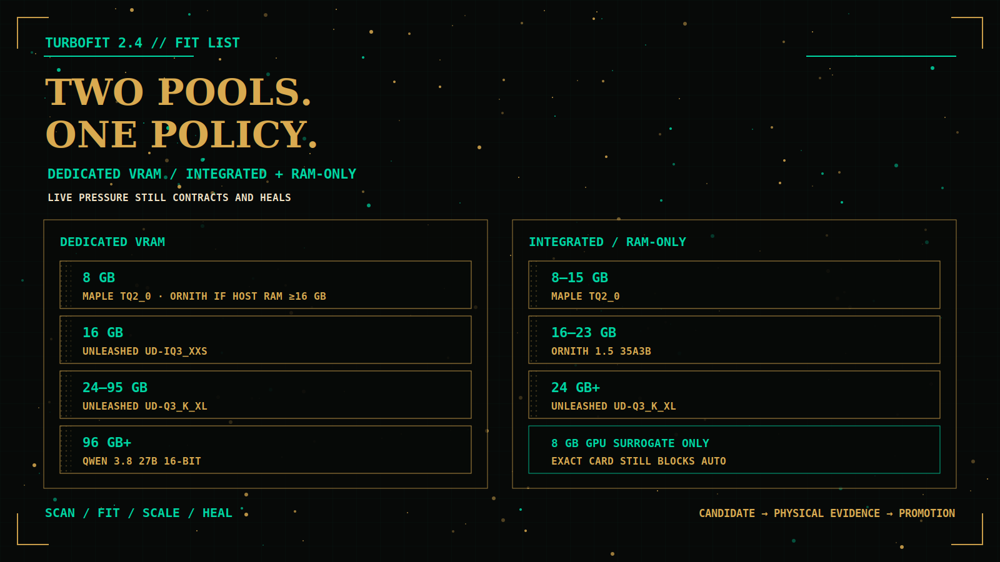
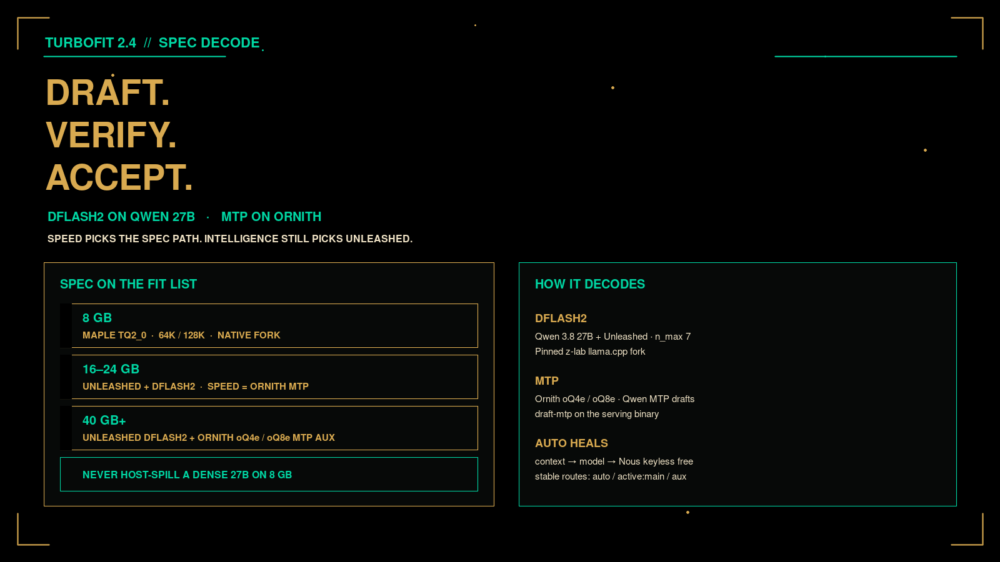

# Turbofit


**One model provider. Every machine. The best local configuration the hardware can safely sustain.**

Turbofit is a first-class [Hermes Agent](https://github.com/NousResearch/hermes-agent) provider and adaptive local-inference runtime. It inventories physical compute and **total usable memory**, recommends an evidence-backed ladder, launches a native backend, and exposes one OpenAI-compatible endpoint. The client-facing name stays `auto` while the backing model, context, and auxiliary mode change.


```text
provider: custom:turbofit
model: auto
```

**TurboFit Check** scans this machine — dedicated VRAM, unified/integrated memory, or RAM-only — and applies Auto or a selected compatible lane. The **[TurboFit List](docs/turbofit-list.md)** is the separate evidence-only winner table by hardware class.

> Catalog entries are **candidates** until the physical campaign passes. Compile, download, or estimated fit is not a winner.

## 2.4 lineup

2.4 keeps the Unleashed / Ornith / Nous-free stack and splits the 8 GB problem into two topologies. **Dedicated VRAM is not the same as total RAM.**

| Model | Entries | Role | Status |
|---|---|---|---|
| **Maple Preview 20B-A1B** | `TQ2_0` | Small-device MoE, ~1B active, native 128K | **Auto on 8 GB at 64K and 128K** |
| **Qwen 3.8 27B Unleashed** | `UD-IQ3_XXS`, `UD-Q3_K_XL` | Uncensored dense 27B, 262K, vision | Active catalog candidates |
| **Ornith 1.5 35A3B** | `Q4_K_M` MoE | Default auxiliary; 16 GB RAM-only main | Active auxiliary candidate |
| **Qwen 3.8 27B** | `Q4_K_M`, `Q8_0`, `BF16` ± MTP | Native image/video | Active catalog candidates |
| **Bonsai 27B** | Q1 / 1-bit | Still in the catalog; no longer the 8 GB Fit List default | Active catalog candidate |
| **MiniMax Music 3** | `minimax-music3` | Full-song music | Pinned integration candidate |
| **NVIDIA Parakeet TDT 0.6B v3** | `parakeet-tdt-0-6b-v3` | Local STT | Pinned integration candidate |
| **Soprano TTS** | `soprano-tts` | Local TTS | Pinned integration candidate |

### Dedicated VRAM

| Capacity | Main path |
|---|---|
| 96 GB+ | Qwen 3.8 27B 16-bit until Unleashed FP16 GGUF exists |
| 24–95 GB | Unleashed UD-Q3_K_XL + DFlash2 |
| 16 GB | Unleashed UD-IQ3_XXS + DFlash2 |
| 8 GB | Maple Preview TQ2_0; Ornith if host RAM can hold offloaded experts |
| Below 8 GB dedicated | Portable-fit only until that box is benched. Never a 9B. |

### Integrated / RAM-only total memory

| Capacity | Main path |
|---|---|
| 24 GB+ | Unleashed UD-Q3_K_XL |
| 16–23 GB | Ornith 1.5 35A3B |
| 8–15 GB | Maple Preview TQ2_0 |

Apple Silicon stays on OrcaRouter Uncensored MLX 4/6/8-bit (never 2-bit). Sub-24 GB Macs stay on Ornith.

Maple is restricted to native 64K/128K. It requires the Maple llama.cpp fork. Auto on `hardware-8gb` now starts at Maple 128K and contracts to Maple 64K.





Auxiliary is **Ornith 1.5 35A3B**, optional **Carwin Nano**, or **auto**. Pressure steps: offload Ornith experts → lower context → aux auto → smaller Unleashed → Maple → keyless Nous free models. Optional FreeToken is a pinned NVIDIA MoE **candidate**, never Auto: [`docs/freetoken-runtime.md`](docs/freetoken-runtime.md).


### Inference engines

Check **auditions** the selected main/aux pair on every engine below. Compatible ≠ installed ≠ running ≠ eligible.

| Engine | What it serves | Maple TQ2_0 | Qwen 3.8 | Where |
|---|---|---|---|---|
| **Turbohaul Manager** | OpenAI/Ollama manager over llama.cpp | only if it drives the Maple fork | preferred GGUF manager | Linux NVIDIA |
| **llama.cpp** | GGUF `llama-server` `/v1` | Maple fork only (`stamsam/llama.cpp` prism) | pinned mainline | Linux, Windows, macOS · CUDA/ROCm/Metal/Vulkan/CPU |
| **MLX** | MLX weights | `deepgrove/maple-preview-2bit-mlx` via mlx-lm-deepgrove | OrcaRouter Uncensored 4/6/8-bit · never 2-bit | Apple Silicon |
| **SGLang** | HF / FP8 / some standard GGUF | no | official Qwen HF recipes | Linux / WSL |
| **vLLM** | HF / FP8 / NVFP4 | no | official Qwen HF / NVFP4 recipes | Linux / WSL · vLLM-Metal on Apple |
| **FreeToken** | HF/FTW MoE | no | only with a supported HF MoE recipe | Linux x86_64 · CUDA 13 · driver r580+ |
| **Lemonade** | NPU | only with a validated NPU recipe | same | fail-closed otherwise |

Serve matrix: [`references/engine-serve-matrix.json`](references/engine-serve-matrix.json). Desktop: **Audition engines**.

### Still in the product

These stay shipped. They are not deleted because Maple is Auto on 8 GB.

| Surface | What |
|---|---|
| **Catalog** | Qwen 3.8 Q4/Q8/BF16 ± MTP, DFlash2 candidate, Bonsai Q1/1-bit/ternary, Ornith, Carwin Nano, Unleashed, Maple |
| **Contexts** | 64K · 128K · 262K · 1M YaRN where the model is native or proven |
| **Adaptive runtime** | pressure contracts experts → context → aux auto → smaller model → keyless Nous free; healing walks back up |
| **Stable routes** | `auto` · `active:main` · `active:aux` |
| **Desktop** | shift, update, Tailscale serve, smoke, audition, Keep/Archive/Delete old weights |
| **Slash** | `/turbofit` scan, status, setup, update, shift, serve, smoke, intelligence, balanced, speed |
| **Sirvir** | GitHub-current support; reciprocal install |
| **Multimodal** | MiniMax H3 video (local INT8 offload proven), Music 3, Parakeet STT, Soprano TTS, ACE-Step candidates |
| **Campaigns** | physical catalog + intelligence; List stays blank until exact-tier evidence |


## What it does

- One stable provider: `custom:turbofit` / `auto`. Routes `active:main` and `active:aux` stay put while the backing process heals or contracts.
- Inventories MLX, llama.cpp, SGLang, vLLM, FreeToken, and [Turbohaul Manager](https://github.com/MrTrenchTrucker/turbohaul-manager). **Audition engines** ranks those engines for the selected main/aux pair using the researched serve matrix. Maple GGUF is the Maple llama.cpp fork (or TurboHaul managing that fork). vLLM/SGLang take Qwen HF/FP8/NVFP4, not Maple TQ2_0. Apple Maple uses `deepgrove/maple-preview-2bit-mlx`.
- Runs native llama.cpp on CUDA, ROCm, Metal, Vulkan, or CPU. Lemonade is used only for a validated NPU recipe.
- Hermes Desktop is the setup surface. `/turbofit` is the slash surface. Both expose the same operational controls.
- [Sirvir](https://github.com/SouthpawIN/sirvir) is GitHub-current support: install, Q&A, tested PRs. Sirvir installs Turbofit when it is missing.
- Private Tailscale Serve publishes this machine’s `:8091` to the tailnet. Funnel is never used.
- Image, video, music, STT, and TTS recommendations live on the same setup page.

## Install

Plugin install registers tools and slash commands, then setup **downloads the recommended models for this machine if they are missing** and starts the local stack.

| Layer | What | Starts when |
|---|---|---|
| Hermes messaging gateway | Discord / Telegram / cron | `hermes gateway …` |
| Turbofit provider gateway | OpenAI `/v1` on **`127.0.0.1:8091`** | Setup / Apply / `/turbofit shift` / native service |
| Native model server | llama-server / backend | Turbofit selection after artifacts land |
| Tailscale Serve | Private HTTPS to other tailnet devices | `/turbofit serve` |

```bash
hermes plugins install --enable https://github.com/SouthpawIN/Turbofit.git
```

**Sirvir handles install and setup.** That is its job. After the plugin is present, start Sirvir and ask it to install Turbofit, download recommended models, and verify a real local completion. A bootstrap fallback exists only so Sirvir can talk while `:8091` is coming up.

`/turbofit` is a **plugin** command. Hermes Desktop profile sessions (including Sirvir) only load plugins from that profile's `plugins/` and `plugins.enabled`. Install still writes the default `~/.hermes` home, so a Sirvir-only Desktop session used to report `not a quick/plugin/bundle/skill command: turbofit`. Setup and update now copy/link the plugin into every Hermes profile and add `turbofit` to each `plugins.enabled`. Restart Desktop or start a new session after install/update.

```text
/turbofit status
/turbofit setup
```

`/turbofit setup` refreshes Hermes **Desktop → Turbofit**. Dashboard is deprecated.

```text
/turbofit                 # scan + intelligence / balanced / speed
/turbofit update          # plugin + Desktop surface + Sirvir
/turbofit shift up        # next smarter measured combo
/turbofit shift down      # next lighter measured combo
/turbofit shift maple     # recommended combo for that model
/turbofit shift intelligence
/turbofit serve           # publish :8091 on your tailnet
/turbofit serve status
/turbofit smoke           # loopback health of the current local runtime; not a promotion bench
```

```bash
curl -fsS http://127.0.0.1:8091/v1/models
```

JSON with `auto` = healthy. Connection refused (`WinError 10061` on Windows) means the Turbofit stack is not running — not a firewall miss, and not a Hermes messaging-gateway problem.

Windows headless path: [`docs/windows-native-install.md`](docs/windows-native-install.md).

## Tailscale — one-setup model server

Turbofit still uses **Tailscale Serve** (private). It never uses Funnel.

On the machine that already answers `http://127.0.0.1:8091/v1/models`:

```text
/turbofit serve
```

That:

1. requires `tailscale` logged in and connected;
2. publishes the provider gateway (`127.0.0.1:8091`) as `https://<magicdns>:9443/v1`;
3. writes that HTTPS URL into the local Hermes `custom:turbofit` provider;
4. also publishes Desktop/setup on `https://<magicdns>:9444/` when that local port is live.

Any other device on the same tailnet uses:

```yaml
providers:
  turbofit:
    base_url: https://<this-machine>.<tailnet>.ts.net:9443/v1
    api_key: not-needed
    model: auto
```

Desktop: **Serve on Tailscale**. Same as `/turbofit serve`. Check with `/turbofit serve status` or `tailscale serve status`.

Public binds stay rejected. Loopback and verified tailnet addresses are the only plain-HTTP exceptions.

## Hermes configuration

```yaml
model:
  provider: custom:turbofit
  default: auto

providers:
  turbofit:
    base_url: http://127.0.0.1:8091/v1
    api_key: not-needed
    model: auto
    model_name: auto
    provider: turbofit
    tool_format: hermes

fallback_providers:
  - provider: nous
    model: meituan/longcat-2.0:free
  - provider: nous
    model: stepfun/step-3.7-flash:free
  - provider: nous
    model: upstage/solar-pro4:free
  - provider: nous
    model: tencent/hy3:free
  - provider: nous
    model: poolside/laguna-s-2.1:free
  - provider: nous
    model: poolside/laguna-xs-2.1:free
  - provider: custom:turbofit
    model: auto
```

Fallback rows are `provider` + `model` only. Desktop edits the whole ordered chain.

## Sirvir


[Sirvir](https://github.com/SouthpawIN/sirvir) is GitHub-current Turbofit customer service: install, Q&A with source/commit citations, and tested pull requests. **Install Sirvir** from Desktop or `/turbofit update`. **Sirvir installs Turbofit when it is missing.** Reciprocal bootstrap:

```bash
git clone https://github.com/SouthpawIN/sirvir.git
cd sirvir
scripts/install
```

**Sirvir handles install and setup.** Verify a real local completion through Sirvir. Profile install must use `https://github.com/SouthpawIN/sirvir.git`. A bootstrap fallback exists only until `http://127.0.0.1:8091/v1/models` answers.

## How it adapts

```text
quality-main + auxiliary + 262K
              │ pressure
              ▼
smaller context / shared aux / smaller model
              │
              ▼
keyless Nous free fallback
```

Pressure drops fast; healing is slower and hysteretic. Transitions lock, fail closed, and roll back. `/turbofit shift` walks the same measured ladder manually. Hardware pools, backends, and offload: [`docs/runtime-backends.md`](docs/runtime-backends.md). Maple small-device evidence: [`docs/maple-small-device-validation.md`](docs/maple-small-device-validation.md).

## Desktop

Hermes Desktop **Turbofit** is the setup surface: hardware, score bars, shift, update, Tailscale serve, fallbacks, runtimes, Sirvir, multimodal. When Check recommends a new main model and the old weights are still on disk, the page shows a gold **New model recommended** card with **Keep both**, **Archive old model**, and **Delete old model**. Source: [`desktop/plugin.js`](desktop/plugin.js).

## More detail

| Topic | Doc |
|---|---|
| Evidence-only winners | [`docs/turbofit-list.md`](docs/turbofit-list.md) |
| Check vs List | [`docs/turbofit-check.md`](docs/turbofit-check.md) |
| Engine serve matrix | [`references/engine-serve-matrix.json`](references/engine-serve-matrix.json) |
| Model matrix, Unleashed, Maple, Bonsai | [`docs/model-matrix.md`](docs/model-matrix.md) |
| Maple small-device validation | [`docs/maple-small-device-validation.md`](docs/maple-small-device-validation.md) |
| Physical + intelligence campaigns | [`docs/campaigns.md`](docs/campaigns.md) |
| Multimodal pins | [`docs/multimodal.md`](docs/multimodal.md) |
| Live 2x24 TPS | [`docs/hardware-tier-tps.md`](docs/hardware-tier-tps.md) |
| Windows native service | [`docs/windows-native-install.md`](docs/windows-native-install.md) |

## Developer verification

```bash
PYTHONPATH=src:. python3 -m pytest -q
node --check dashboard/dist/index.js
node --check desktop/plugin.js
scripts/release-check
```

## License

See [`LICENSE`](LICENSE).
