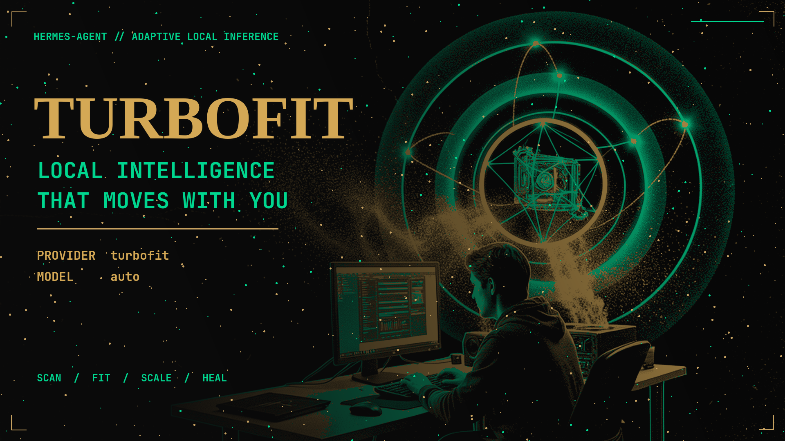
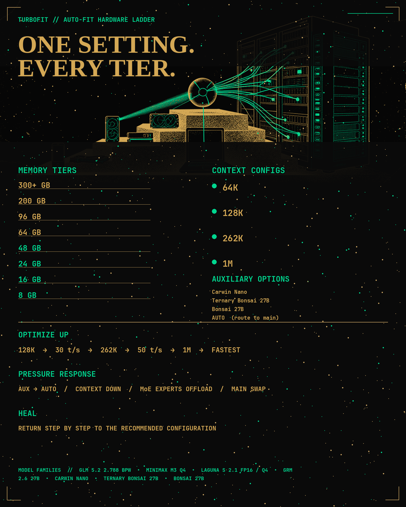
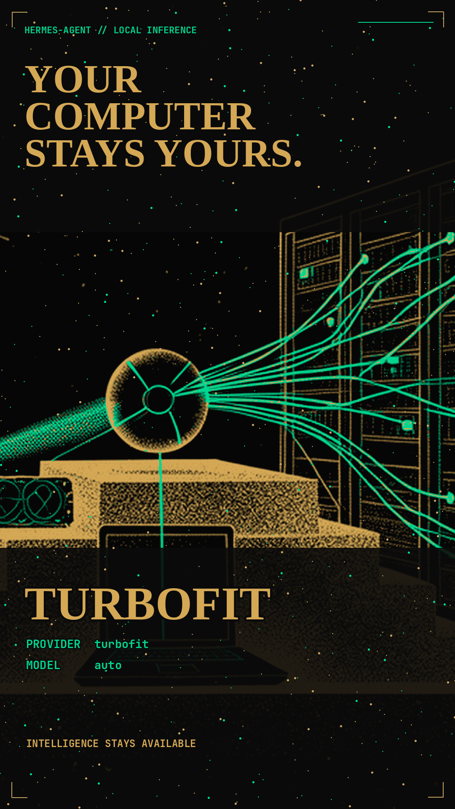

# Turbofit



<p align="center">
  <a[▶ Watch the 53-second Turbofit](https://x.com/vSouthvPawv/status/2081193435172618461?s=20)</strong></a>
</p>

**A local-model provider for Hermes Agent that fits itself around the way you use your computer.**

Turbofit detects the machine's physical accelerator topology, selects a local main/auxiliary model ladder, downloads the required artifacts through [Turbohaul Manager](https://github.com/MrTrenchTrucker/turbohaul-manager), and exposes stable OpenAI-compatible model IDs to Hermes Agent.

When another program needs VRAM, Turbofit contracts one step at a time: it can remove a dedicated auxiliary residency, route auxiliary work through the main model, reduce context, or move to a smaller local model. After memory remains available long enough, it heals back toward the selected ceiling.

> **Current scope is local-only.** Turbofit does not select, configure, or fall back to API models. API orchestration is recorded under [Later development](#later-development), not presented as a current feature.

## What works now

- **Hermes provider:** one local OpenAI-compatible endpoint with stable `auto`, `active:main`, and `active:aux` IDs.
- **Hardware-aware auto selection:** canonical profiles from 8 GB through 300+ GB; no 48 GB runtime special case.
- **Manual profile selection:** pin the adaptive ceiling to a compatible hardware profile.
- **Managed model acquisition:** first activation pulls missing GGUF artifacts from pinned Hugging Face commits, verifies SHA-256, deduplicates shared blobs, installs Turbohaul manifests, and verifies the final tags before inference.
- **Adaptive local scaling:** contraction dwell, expansion dwell, hysteresis, cooldown, rollback, and flap quarantine.
- **External workload priority:** Turbofit never kills or signals games, editors, renderers, or other GPU consumers.
- **Verified publication:** a new route is published only after its local model rung loads and passes verification.
- **Portable configuration:** Turbofiles contain no credentials, machine-local paths, mutable process state, or embedded model binaries.

## Hardware tiers



The graphic shows the full product ladder: hardware tiers, context targets, auxiliary choices, pressure response, and the model families moving through promotion. The table below distinguishes the local ladders available now from higher-context and broader-model combinations still awaiting evidence.

Turbofit ships local-only profiles for these physical classes:

| Class | Canonical topology | Current local ladder |
|---:|---|---|
| 8 GB | `1x8` | Bonsai 27B 1-bit, 64K shared main/aux floor |
| 16 GB | `1x16` | Bonsai 27B 1-bit: 262K → 128K → 64K |
| 24 GB | `1x24` | GRM 2.6 Plus 128K → Bonsai 262K → 128K → 64K |
| 48 GB | `2x24` | GRM 262K + dedicated Bonsai 262K aux → shared GRM → Bonsai floors |
| 64 GB | `2x32` | same verified dual-model ladder with additional headroom |
| 96 GB | `4x24` | same verified dual-model ladder; unused cards remain available to other work |
| 200 GB | `2x100` | same verified dual-model ladder while larger candidates are promoted |
| 300+ GB | `3x100` | same verified dual-model ladder; unused cards remain available to other work |

Profiles are selected from physical capacity, not transient free VRAM. Larger cards can satisfy a smaller per-card envelope when card count and topology shape remain compatible; `1x48` is still not treated as `2x24`.

The Bonsai floor was measured on the current benchmark host. The 8/16/64/96/200/300 class mappings are portable recommendations, not claims of completed benchmarking on every accelerator family. Activation remains fail-closed if Turbohaul cannot load or verify a selected rung.

## Selection and model downloads

```bash
# Show local profiles, rungs, and compatibility with this machine
scripts/turbofit-runtime list

# Let Turbofit choose from physical hardware
scripts/turbofit-runtime set auto

# Or select a compatible local profile explicitly
scripts/turbofit-runtime set hardware-16gb

# Inspect the persisted selection
scripts/turbofit-runtime status

# Run one controller reconciliation
scripts/turbofit-controller --once

# Optional persistent user service
scripts/install-controller-service --start
```

A new selection starts at its smallest local floor—not at an API fallback. Before that floor is published, the controller:

1. Resolves every model tag required by the rung.
2. Checks Turbohaul's installed tags and content digests.
3. Pulls each missing Hugging Face artifact from an exact commit.
4. Requires the downloaded SHA-256 to match the acquisition catalog.
5. Reuses a verified blob when several model tags share it.
6. Installs the context/runtime manifest for each tag.
7. Loads and verifies the selected local rung.
8. Atomically publishes the stable routes.

Acquisition recipes live in `runtime-profiles/acquisitions.json`. Model lifecycle authority remains in Turbohaul Manager; Turbofit does not create a second model store.

## Hermes Agent provider

Run the Turbofit gateway at `http://127.0.0.1:8091`, then configure one provider:

```yaml
custom_providers:
  - name: turbofit
    base_url: http://127.0.0.1:8091/v1
    api_key: not-needed
    api_mode: chat_completions
    models:
      auto: {}
      active:main: {}
      active:aux: {}

model:
  provider: custom:turbofit
  default: auto
```

Stable model IDs:

| ID | Meaning |
|---|---|
| `auto` | current selected main route |
| `active:main` | current main residency |
| `active:aux` | dedicated auxiliary when present, otherwise shared main |

The IDs stay constant while the controller changes the backing local model and context.

## Install

```bash
hermes skills tap add SouthpawIN/turbofit
hermes skills install SouthpawIN/turbofit/skills/turbofit
```

Development should happen from a Git checkout, not the installed skill directory.

Current requirements:

- Python 3.11+
- Hermes Agent
- Turbohaul Manager v0.7
- PyYAML for YAML Turbofiles
- a supported local runtime/accelerator backend
- network access to the pinned Hugging Face artifacts on first acquisition

NVIDIA is the currently exercised backend. The Turbofile and acquisition contracts are system-independent; additional runtime backends still require implementation and validation.

## Adaptive behavior

<p align="center">
  
</p>

A representative ladder is:

```text
local main + dedicated local auxiliary
→ local main shared with auxiliary work
→ smaller local model/context
→ minimum local floor
```

Contraction occurs only after a sustained deficit. Healing occurs one rung at a time only after the configured margin, dwell, hysteresis, cooldown, and flap controls pass.

A transition:

1. Blocks new auxiliary admission when leaving dedicated mode.
2. Drains active auxiliary streams.
3. Requests clean unload through Turbohaul.
4. Activates or acquires the target local rung.
5. Verifies the target.
6. Atomically publishes routes.
7. Restores and verifies the previous state on failure.

At the minimum local floor, Turbofit does not route to an API model. If no lower local rung fits, it holds the floor and reports the capacity condition.

## Configuration and evidence

| Path | Purpose |
|---|---|
| `runtime-profiles/*gb.yaml` | production hardware profiles |
| `runtime-profiles/acquisitions.json` | pinned sources, hashes, and Turbohaul tag recipes |
| `runtime-profiles/runtime-resolutions.json` | rung-to-model-tag resolution |
| `runtime-profiles/rung-requirements.json` | per-card VRAM requirements |
| `references/model-catalog.json` | requested model variants and capabilities |
| `references/configuration-matrix.json` | generated main × auxiliary × context candidate space |
| `benchmarks/suite.yaml` | promotion gates |
| `references/results/` | measured machine-readable evidence |

The candidate matrix contains the requested 12 main variants × 4 auxiliary modes × 4 contexts: **192 research candidates**. A candidate row is not automatically a production recommendation. Production promotion requires artifact, runtime, performance, quality, and pressure/self-heal evidence.

The current source list includes:

- [GLM/GRM 5.2 2.788 bpw](https://huggingface.co/sokann/GLM-5.2-GGUF-2.788bpw)
- [MiniMax M3 GGUF](https://huggingface.co/unsloth/MiniMax-M3-GGUF)
- [Laguna S 2.1](https://huggingface.co/poolside/Laguna-S-2.1)
- [Laguna S 2.1 GGUF](https://huggingface.co/unsloth/Laguna-S-2.1-GGUF)
- [GRM 2.6 Plus GGUF](https://huggingface.co/bartowski/OrionLLM_GRM-2.6-Plus-0628-GGUF)
- [Carwin MoE Nano GGUF](https://huggingface.co/isneezekittens/Carwin-MoE-Nano-GGUF)
- [Ternary Bonsai 27B GGUF](https://huggingface.co/prism-ml/Ternary-Bonsai-27B-gguf)
- [Bonsai 27B GGUF](https://huggingface.co/prism-ml/Bonsai-27B-gguf)

## Performance priorities

Candidate ranking follows:

```text
quality
→ reach 128K context
→ reach 30 tok/s
→ reach 262K context
→ reach 100 tok/s
→ reach 1M context
→ maximize speed
```

Measured claims remain attached to their exact artifact, runtime flags, context, host fingerprint, throughput, TTFT, and per-card VRAM evidence.

## Hybrid large-model bring-up

`runtime-profiles/hybrid-models.json` now defines the first **configured-unmeasured** dual-24 GB GPU + system-RAM placements for Laguna S 2.1 Q4_K_M, MiniMax M3 MXFP4_MOE, and GLM 5.2 2.788 bpw. Every artifact is bound to an immutable Hugging Face revision, required SHA-256 identity, and exact file size. These configurations remain candidates until their own benchmark evidence passes; they are not production recommendations yet.

The configuration checker reports both static `hardware_fits` and current `launch_ready`, so a machine is not called ready while another resident model still occupies required VRAM:

```bash
PYTHONPATH=src scripts/turbofit-hybrid-config list
PYTHONPATH=src scripts/turbofit-hybrid-config check glm-5-2-2-788bpw dual-24gb-64k
```

The evidence-first benchmark stage records raw responses, measured token usage, exact-answer quality checks, passkey context retrieval, effective end-to-end output throughput, host RAM, per-GPU VRAM, and an evidence SHA-256:

```bash
PYTHONPATH=src scripts/turbofit-benchmark-stage \
  --candidate <model-id> \
  --configuration dual-24gb-64k \
  --base-url http://127.0.0.1:<port>/v1 \
  --model <served-model> \
  --output references/results/<run>.json
```

## Verification

```bash
# Unit, integration, schema, profile, link, and simulated adaptation checks
scripts/release-check

# Adds live NVML, Turbohaul, stable-route, controlled-pressure,
# external-process survival, contraction, and healing checks
scripts/release-check --real
```

A simulated pass is not represented as real pressure evidence. The latest machine-readable acceptance record is stored at `references/results/adaptive-runtime-acceptance.json`.

## Safety invariants

<p align="center">
  
</p>

- External GPU processes are never terminated or signaled.
- Physical capacity selects the profile; transient availability selects the rung.
- All model lifecycle operations go through Turbohaul.
- Downloads use pinned revisions and required SHA-256 values.
- Missing or mismatched artifacts fail closed.
- New routes are not published before local verification.
- Credentials and machine-local paths never enter portable profiles.
- Research candidates never become production recommendations automatically.

## Later development

The earlier Turbofit README described a broader product. Those ideas are retained here as roadmap—not current behavior:

- broader local recommendations that fully use 64/96/200/300+ GB systems
- per-model/per-aux/per-context manual configuration selection
- 64K, 128K, 262K, and 1M promotion coverage across the complete model matrix
- expert offload before MoE model replacement
- multimodal routing and Bonsai/DSpark vision variants
- additional Linux, Windows, macOS, NVIDIA, AMD, Intel, and Apple runtime backends
- remote access and administration, including Tailscale workflows
- Mixture-of-Agents presets
- live benchmark leaderboards and model discovery feeds
- pricing awareness for a future opt-in API mode
- opt-in API providers, free-tier routing, and API fallback
- model-database updates and recommendation intelligence
- richer daemon/service management outside systemd

None of these roadmap items should be inferred from the current release until its implementation and verification gates land.

## License

MIT License. Copyright (c) 2026 **sovthpaw (SouthpawIN)**. See [`LICENSE`](LICENSE).

## Repository map

```text
src/turbofit_runtime/       schemas, selection, acquisition, policy, controller
runtime-profiles/           production profiles and runtime catalogs
benchmarks/                 promotion suite
research/                   candidate-only discovery
scripts/turbofit-runtime    list/set/status selection CLI
scripts/turbofit-controller adaptive local controller
scripts/turbofit-gateway.py stable OpenAI-compatible gateway
references/results/         measured evidence
assets/turbofit-hero.png    README image
tests/                      unit and integration gates
```
